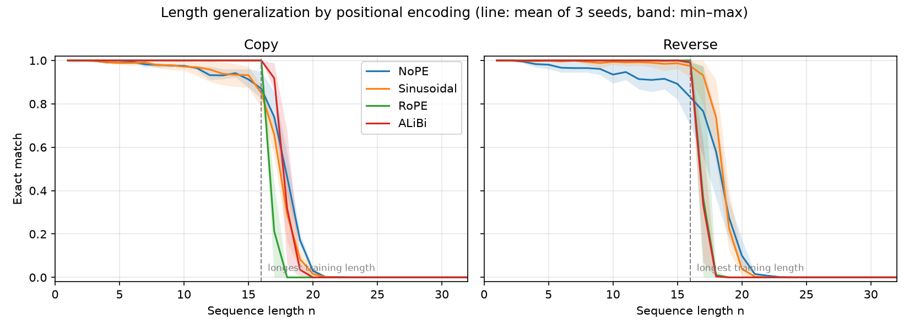
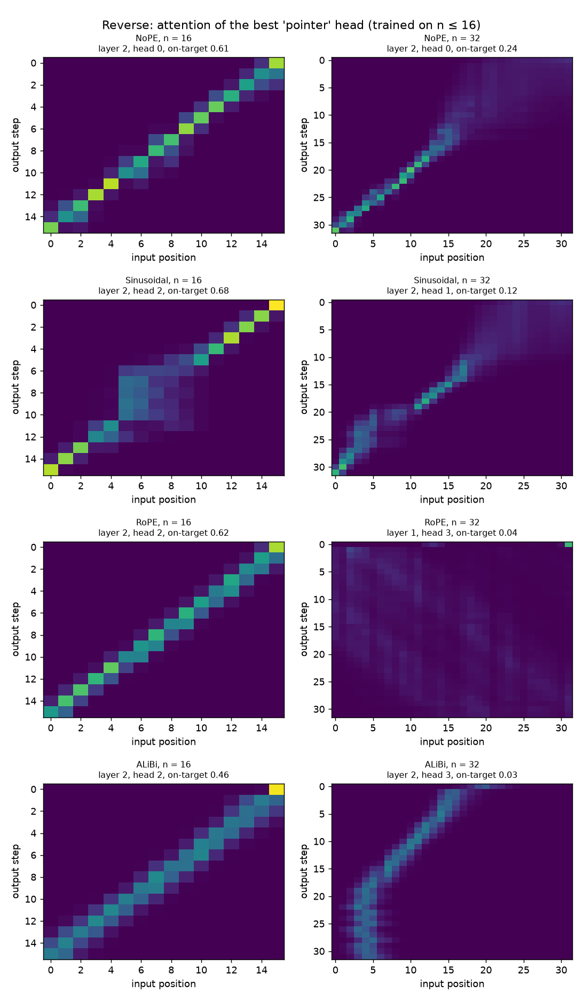

# Positional Encodings and Length Generalization

A Transformer built from PyTorch primitives, used to run a small-scale replication of
[Kazemnejad et al., *The Impact of Positional Encoding on Length Generalization in Transformers* (NeurIPS 2023)](https://arxiv.org/abs/2305.19466)
on a laptop CPU.

**Question:** a decoder-only Transformer is trained on sequences of length ≤ 16. How well
does it handle longer sequences, depending on how it encodes position?

**Result:** no encoding generalizes far. Across 3 seeds, every model is at 0% exact match by length 24, 1.5× the longest training length, and they fail in different ways. **RoPE** breaks first: 100% at n = 16, then 21% on copy one token later and 0% at n = 18. **ALiBi** depends on the task: the best encoding on copy at n = 17 (92%) but collapsing on reverse (34%). **Sinusoidal** is the best on reverse just past training (93% at n = 17, 74% at n = 18). **NoPE** is the paradox: the weakest model inside the training range (87% on copy and 83% on reverse at n = 16), yet the best on both tasks at n = 19 and 20 and the only one still above zero at n = 22.



## Setup

| Setting | Value |
|---|---|
| Model | Decoder-only Transformer, d_model 64, 4 heads, 3 layers, d_ff 256, post-LN, no dropout |
| Positional encodings | none (NoPE), sinusoidal (absolute), RoPE, ALiBi |
| Tasks | **copy** `x → x` and **reverse** `x → reverse(x)` |
| Format | `[BOS, x1..xn, SEP, y1..yn, EOS]`, loss on `y1..yn, EOS` only |
| Vocabulary | 20 symbols + PAD, BOS, SEP, EOS |
| Training | n uniform in [1, 16], batch 64, 3,000 steps, AdamW lr 1e-3, warmup + cosine decay, grad clip 1.0 |
| Evaluation | every n in [1, 48], 256 sequences per length, same sequences for every model |
| Metric | exact match: all n symbols and EOS correct under greedy decoding |

Exact match is computed in one teacher-forced pass: a row is fully correct given the true
prefix exactly when greedy decoding would reproduce it. A unit test checks this against
step-by-step generation.

## Results

Exact match (%) at each length, mean ± std over 3 seeds, trained on n = 1–16 (from [`results/summary.md`](results/summary.md)). "Longest n ≥ 90%" is the largest n such that every length up to it scores at least 90%, averaged over seeds.

| Task | Encoding | Seeds | n = 1–16 | n = 16 | n = 17 | n = 18 | n = 20 | n = 24 | Longest n ≥ 90% |
|---|---|---|---|---|---|---|---|---|---|
| copy | NoPE | 3 | 96.5 ± 1.1 | 87.0 ± 5.6 | 74.0 ± 8.3 | 46.4 ± 8.2 | 3.0 ± 0.9 | 0.0 ± 0.0 | 15.0 |
| copy | Sinusoidal | 3 | 96.7 ± 1.9 | 85.0 ± 4.9 | 65.8 ± 7.5 | 29.2 ± 10.7 | 1.6 ± 1.7 | 0.0 ± 0.0 | 14.0 |
| copy | RoPE | 3 | 100.0 ± 0.0 | 100.0 ± 0.0 | 21.2 ± 17.7 | 0.0 ± 0.0 | 0.0 ± 0.0 | 0.0 ± 0.0 | 16.0 |
| copy | ALiBi | 3 | 100.0 ± 0.0 | 100.0 ± 0.0 | 91.8 ± 5.2 | 31.9 ± 25.9 | 0.0 ± 0.0 | 0.0 ± 0.0 | 16.7 |
| reverse | NoPE | 3 | 94.7 ± 3.6 | 83.1 ± 11.9 | 76.6 ± 17.1 | 57.9 ± 16.3 | 10.0 ± 5.3 | 0.0 ± 0.0 | 12.3 |
| reverse | Sinusoidal | 3 | 99.3 ± 1.0 | 97.4 ± 3.7 | 93.1 ± 9.5 | 73.7 ± 15.8 | 3.9 ± 3.9 | 0.0 ± 0.0 | 17.0 |
| reverse | RoPE | 3 | 100.0 ± 0.0 | 100.0 ± 0.0 | 36.6 ± 43.0 | 1.0 ± 1.5 | 0.0 ± 0.0 | 0.0 ± 0.0 | 16.3 |
| reverse | ALiBi | 3 | 99.9 ± 0.1 | 99.1 ± 1.0 | 33.5 ± 22.7 | 0.4 ± 0.3 | 0.0 ± 0.0 | 0.0 ± 0.0 | 16.0 |

### What the model attends to



For each encoding, the head that puts the most attention on the input symbol it has to
output next, at the longest training length (n = 16) and at twice that (n = 32), for the seed-0 models.
At n = 16, NoPE, RoPE and ALiBi show a clean anti-diagonal pointer; sinusoidal's is smeared over the middle of the sequence. At n = 32 the NoPE and sinusoidal heads largely keep that pointer for input positions inside the trained range (roughly the first 16) and smear beyond it; the RoPE pointer is gone entirely; and the ALiBi head still produces a diagonal, but at the wrong offset, stalling around input position 4–5. Each heatmap shows one example; the on-target score in each title averages 64.

## Comparison with the paper

- **Agrees: RoPE extrapolates poorly.** RoPE has the sharpest cliff of the four on copy and ties ALiBi for it on reverse, consistent with the paper's finding that the popular relative schemes (RoPE, ALiBi) generalize poorly.
- **Partly agrees: NoPE.** The paper ranks NoPE best overall. Here NoPE is the best encoding at n = 19–20 on both tasks and has the longest tail, but by then every model is below 30%, and NoPE is the weakest model inside the training range.
- **Disagrees: sinusoidal.** The paper finds absolute encodings generalize poorly. Here sinusoidal is the best encoding on reverse one and two tokens past training. Its table at n = 17 (93.1 ± 9.5%) is well clear of RoPE and ALiBi (about 35%).
- **Mixed: ALiBi.** Poor on reverse, as in the paper, but the best encoding just past training on copy, where every output's source token is the same distance back within a sequence: a pattern a distance-based bias can encode directly.
- **Scale.** The paper trains much larger models on many more tasks, so these runs test whether its qualitative ranking shows up at small scale, not its exact numbers.

## Limitations

- **Scale.** About 150k parameters and 3,000 steps, against the paper's much larger
  models. The machine was shared with other training jobs, so the model and step budget
  were cut to fit.
- **Three seeds.** Variance is high right at the boundary: RoPE on reverse at n = 17 is
  36.6 ± 43.0%, so rankings at a single length can flip between seeds.
- **Two tasks.** Copy and reverse only; the paper also covers arithmetic and other
  reasoning tasks.
- **In-distribution bar.** Three of the 24 runs miss the 95% in-distribution bar: copy with sinusoidal, seed 0 (94.1%), and reverse with NoPE, seeds 0 and 1 (92.2% and 92.1%). NoPE also scores well below its average at n = 16 (87.0% on copy, 83.1% on reverse), so part of its gradual decline past n = 16 comes from not fully fitting the longest training lengths rather than from better generalization.

## Reproduce

```bash
uv sync                                                    # Python 3.12, CPU PyTorch
uv run pytest                                              # 64 tests
uv run python -m scripts.sweep --seeds 0 1 2 --steps 3000  # results/runs/*.json
uv run python -m scripts.plot                              # figures + results/summary.md
uv run python -m scripts.export_web                        # results/web/study.json for the website
```

A single run: `uv run python -m transformer.train --task reverse --pos-encoding rope --seed 0`.

## Repository layout

```
transformer/
  attention.py    scaled dot-product attention (+ additive bias), multi-head attention (+ RoPE hook)
  positional.py   sinusoidal table, RoPE, ALiBi
  blocks.py       feed-forward, encoder and decoder blocks, causal and padding masks
  seq2seq.py      the original encoder-decoder Transformer and greedy decoding
  decoder_lm.py   decoder-only model with a selectable positional encoding
  tasks.py        copy / reverse data
  train.py        training loop, per-length evaluation, single-run CLI
scripts/
  sweep.py        runs the grid in parallel, resumable
  plot.py         figures and summary table
tests/            pytest suite
results/          per-run JSON, figures, summary.md
```

## Background: the encoder-decoder

The project started as a from-scratch encoder-decoder Transformer ("Attention Is All You
Need"): multi-head attention, sinusoidal positional encoding, causal and padding masks,
cross-attention and greedy decoding, built only from PyTorch tensor operations. The test
suite checks the attention against `torch.nn.functional.scaled_dot_product_attention` and
`torch.nn.MultiheadAttention` numerically. The decoder-only model for this study reuses
the same blocks.
